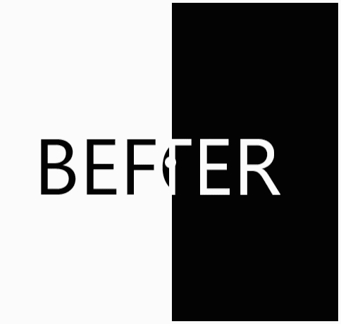

# Before & After Slider

Image comparison component implementation for Compose

___

## Features

- Horizontal and vertical slider orientation
- Default, minimum and maximum percentage setting
- Drag policies
- Overriding percentage to use a custom value (dragging is not possible unless null is passed)

## Examples

- [Slider animation using overridden percentage](./example/src/main/kotlin/SliderAnimationExample.kt)
- [Slider usage demonstration](./example/src/main/kotlin/SliderUsageExample.kt)